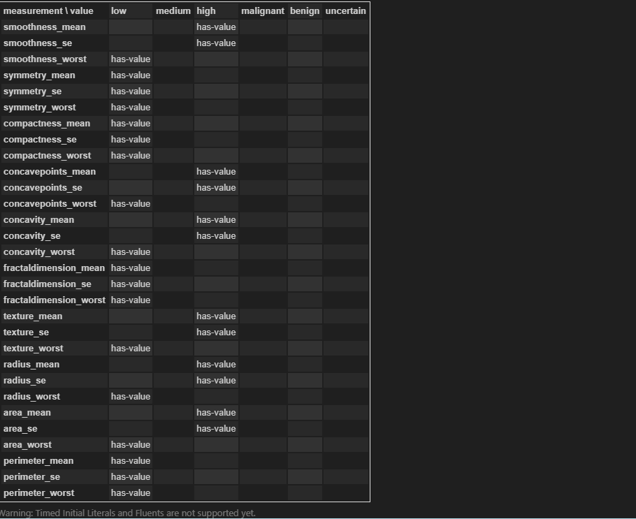
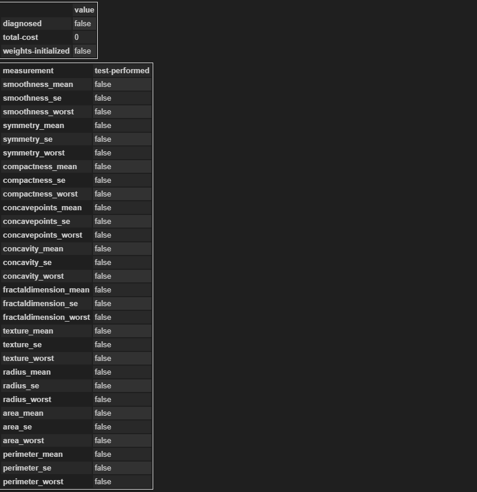
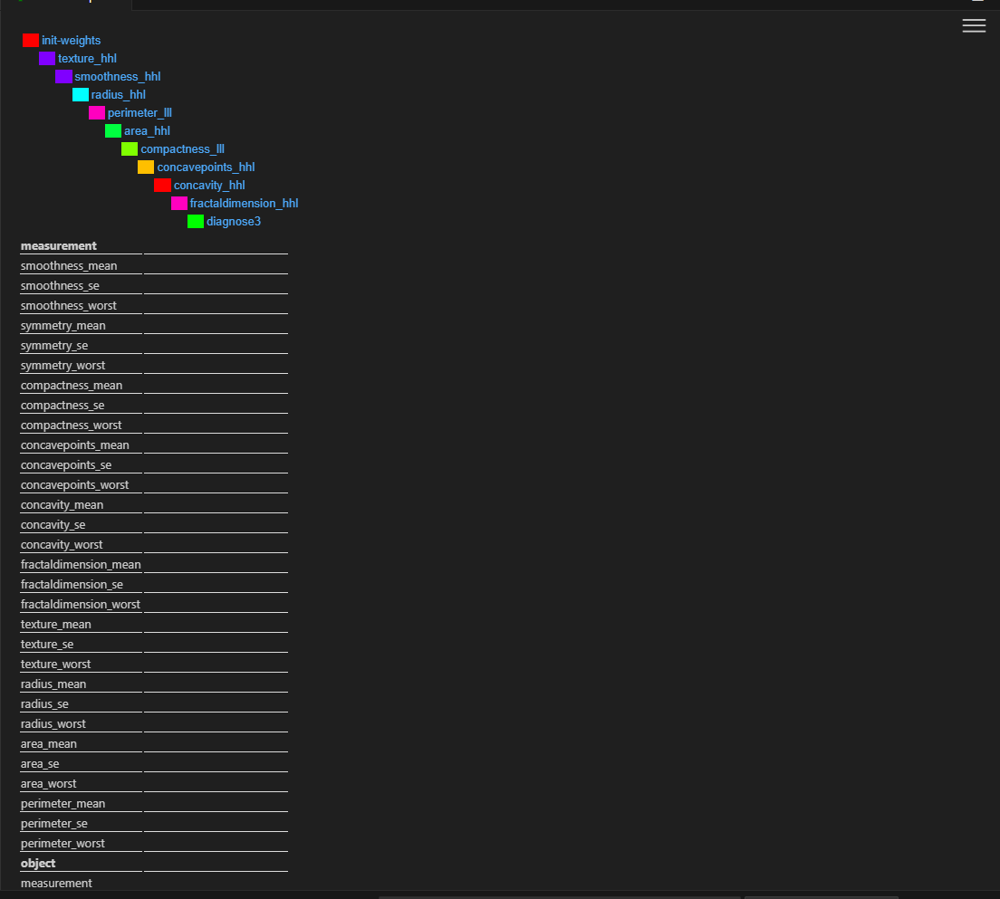

# Instruction of inital implementation and result

## Project structure 

### Planner  -  LAMA
### change problem file section of has-value or not (test-performed) to see differernt plans

### to minic feedback system(automated pipeline which not yet implemented but to check the logistic of the code please find plan_manager.py) then comment or uncommment different diagnose actions

