# BNN intialization instruction

## Please use googel colab to see the result. the pictures will provided in the zip folder as well as in the report but to try and experience the code. please use google colab free GPU to avoid local GPU overusage and potential damages.

## copy this code into google colab and install the dataset under dataset folder and uploads to google colab upon request by the code.

This is the comparsion in the preprocessing steps with comparsion of the distribution since we wanted to best starting with normal distribution looking like dataset and not right or left screwered

This vivually demonstartes the difference and impact each distribution method used in chart 
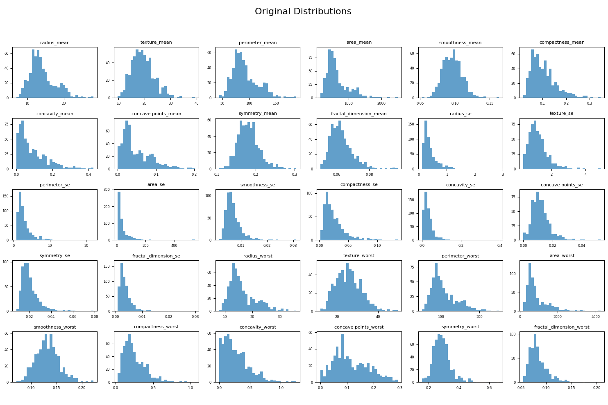
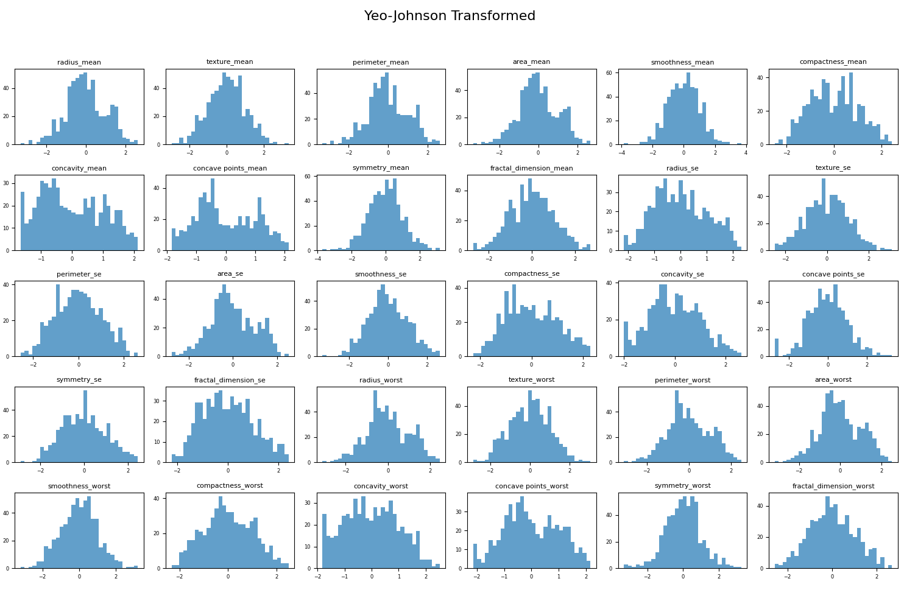
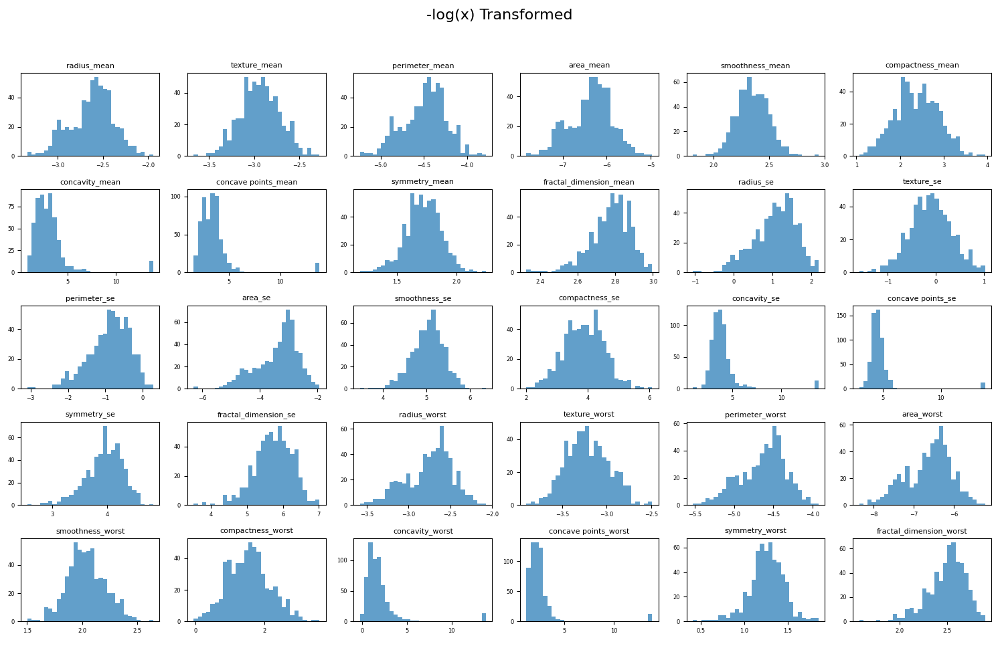

the loss function is also another thing was improved from the draft project. 

with 0.01 learning rate
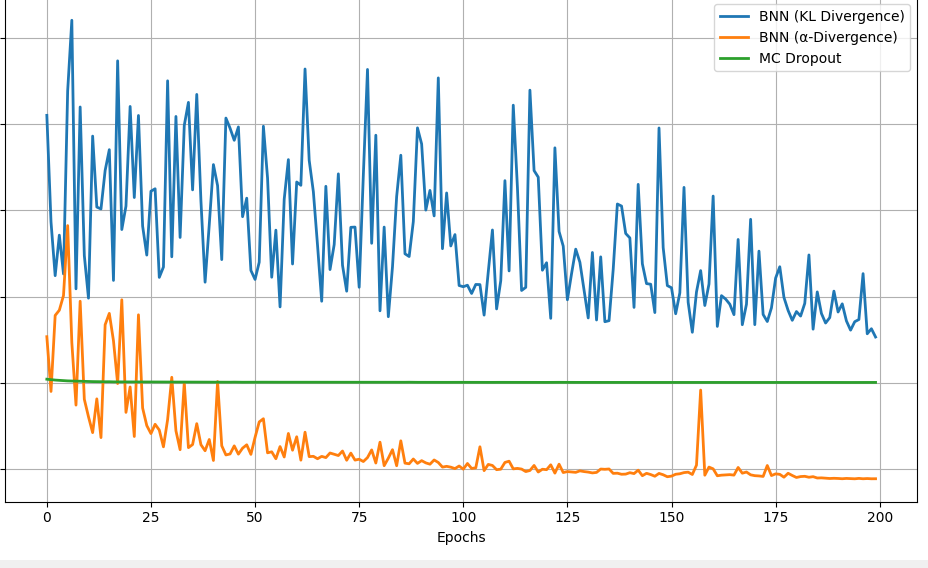 
with 0.1 learning rate
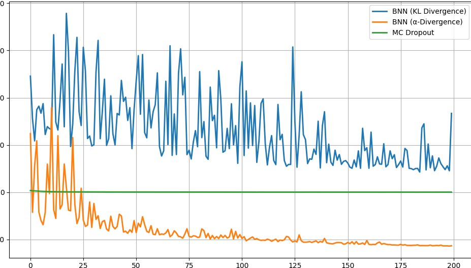

This is with different optimzers
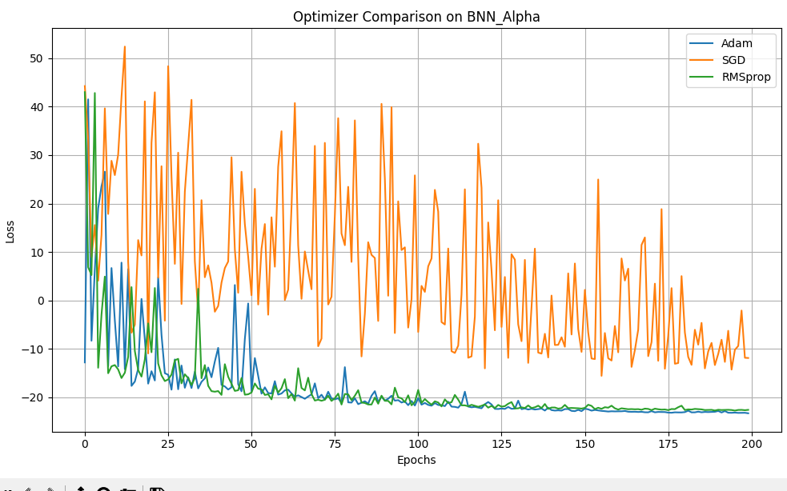

And lastly the model comaprsions
KL = 
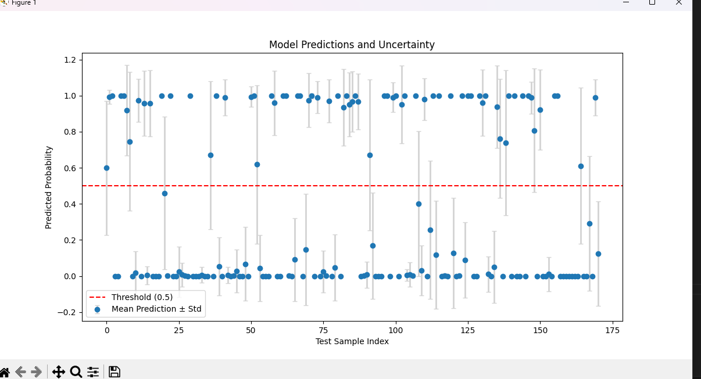
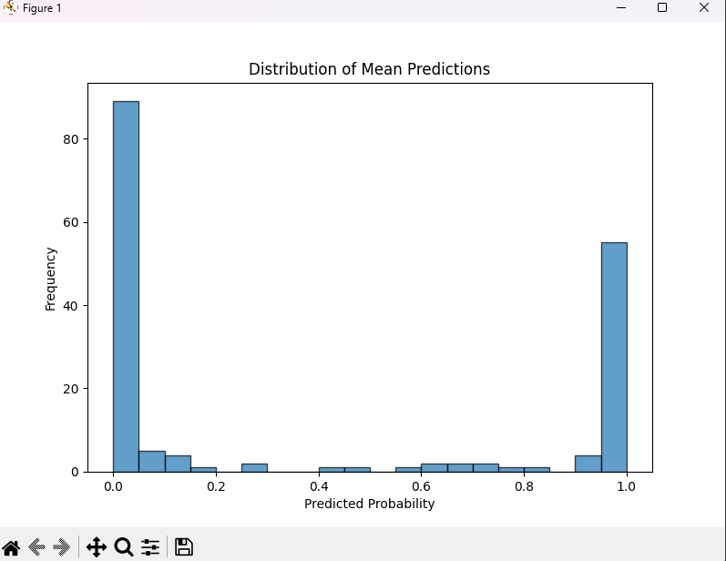

Alpha = 
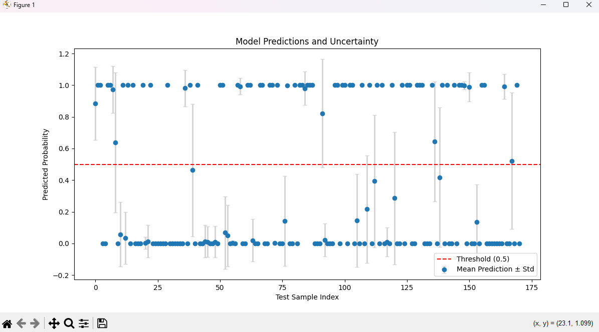
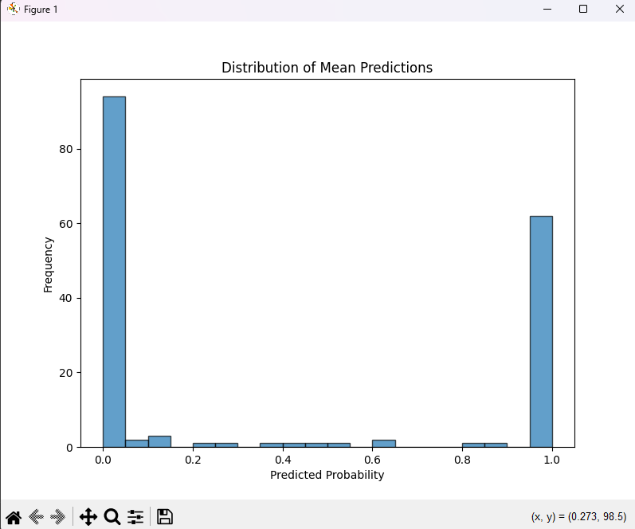

McDropOut = 
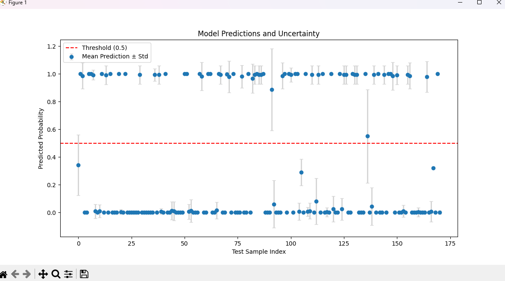
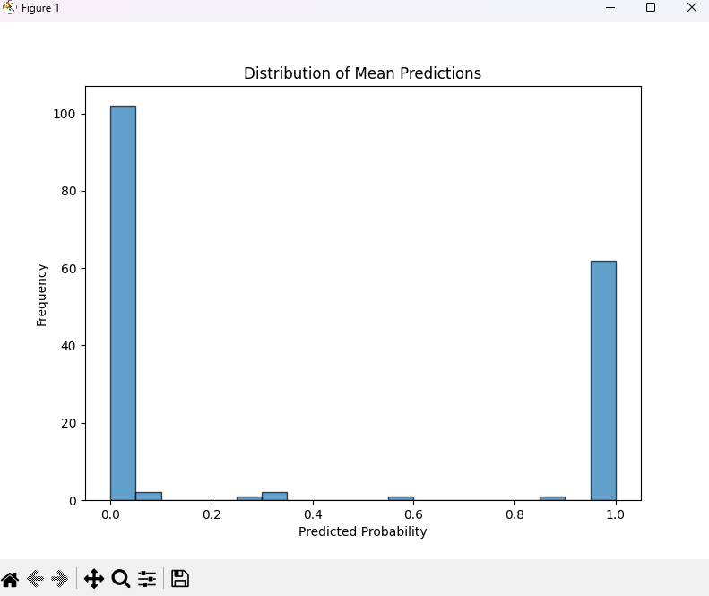