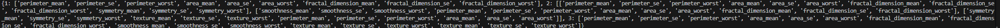
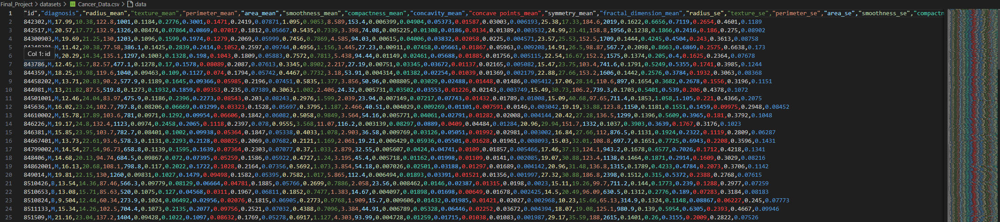
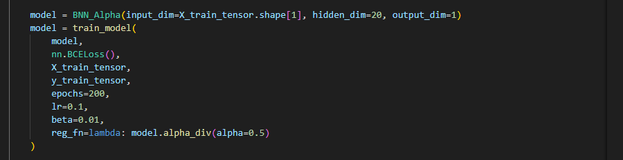
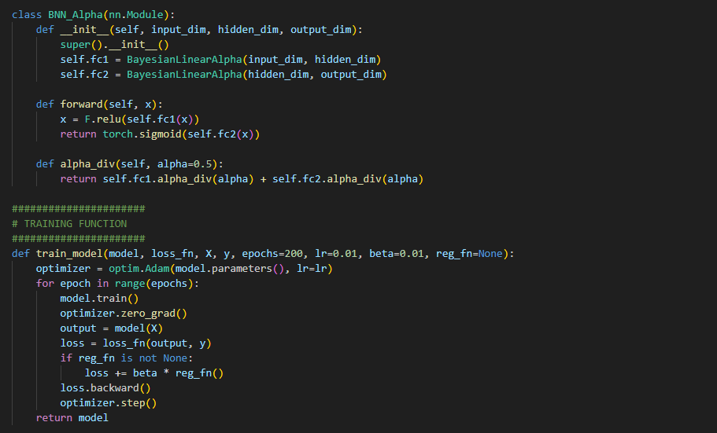

# Instruction to the automated project

This project simulates the behavior of the LAMA planner. Because the original planner's source is hosted on a remote machine — making it inaccessible for file path execution — we cannot directly incorporate or control the PDDL files. However, based on the planning concepts studied in the course, this project implements a simulation that mimics LAMA’s behavior through a custom plan extension.

In the auomated process inputs from the hospital or patient will be a csv file containing their information by filling out their testing results under the corresponding features. This can be done through using an excel file and converting an excel file to the csv file. 

This is the example but user dont have to fill the diagnose section. they will be dropped in the process 
And as minicing the user patients testing and it is time comsuming for you and and professor to input the patient data. But again, if you want. welcome to goahead and modify the csv file by inputting the nunmbers that you desire for patient by creating one. 

And then in the following steps imported the prediction and train_models from BNN_model and adjusting numbers approatiately and also BNN_alpha these classes and functions we can inherently part of its propoerties to use in the plan manager. 

versus actual model designing

Now then we have to iteratly runthorugh the patient to provide the answer