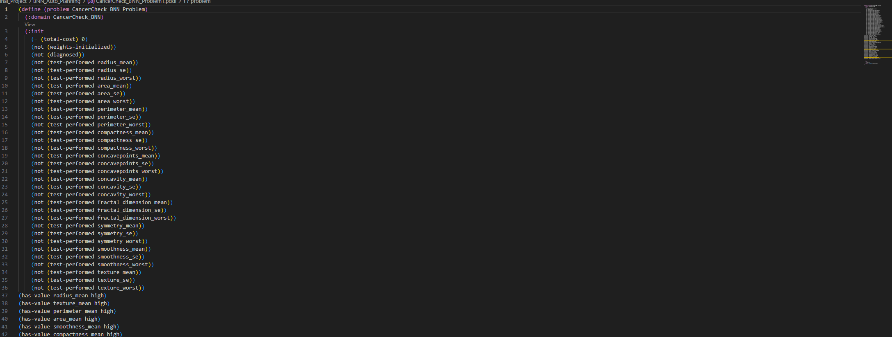
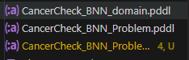
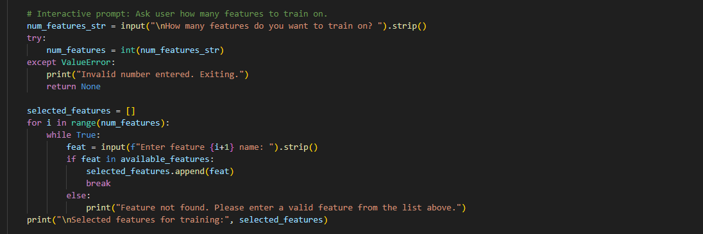
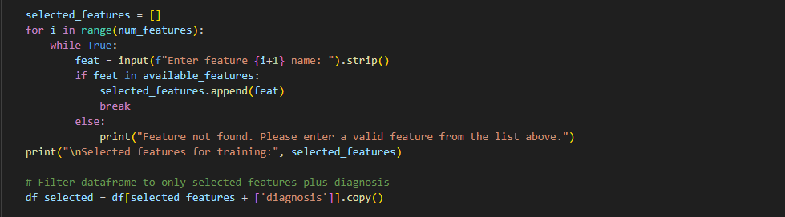
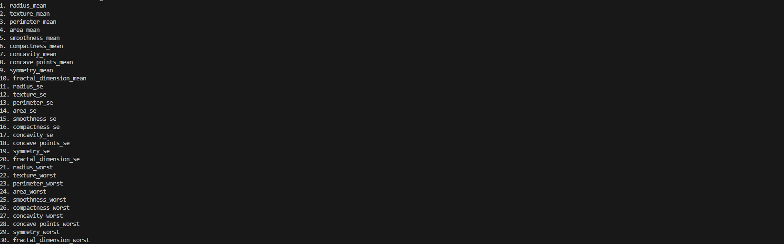
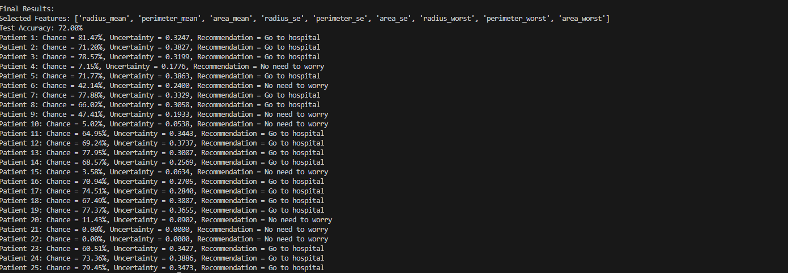

# Instruction to the Manumal project

This intial setting helps to load the problem.pddl and provides a new file. this helps in defineing in low and medium and highs. 
And then there will be needed for manaual plan running by the user so that it generates the plan and provides to the plan_manger and plan manager provides the rest to the model trainning to provide results. 

In using the planning.pddl which includes both domain and problem. Please right clicks the files and use LAMA as planner solver and then proceeds to observe the features in the plan that was generated and then inputs into the plan_manager.
please for each feature you see from the plan meaning that there are three sub-features with worst, se and mean and for each of those, do have to identify their low, medium and high values

As the reuslt. it will presented as these
