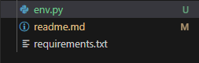

# To ensure this project runs without errors

pip install -r requirements.txt
(Make sure you directed into the final project directory and then run the script)

## THIS IS VERY IMPORTANT
And you have to replace every file directory to your own in the env.py 
You have to modify these the env.py and pipinstall requirements.txt before running the project. 

